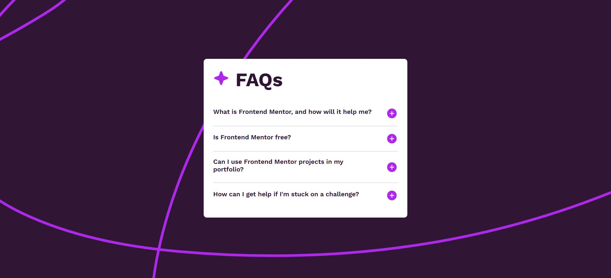

# Frontend Mentor - FAQ accordion solution

This is a solution to the [FAQ accordion challenge on Frontend Mentor](https://www.frontendmentor.io/challenges/faq-accordion-wyfFdeBwBz). Frontend Mentor challenges help you improve your coding skills by building realistic projects. 

## Table of contents

- [Overview](#overview)
  - [The challenge](#the-challenge)
  - [Screenshot](#screenshot)
  - [Links](#links)
- [My process](#my-process)
  - [Built with](#built-with)
  - [What I learned](#what-i-learned)
  - [Continued development](#continued-development)
  - [Useful resources](#useful-resources)
- [Author](#author)

## Overview

### The challenge

Users should be able to:

- Hide/Show the answer to a question when the question is clicked
- Navigate the questions and hide/show answers using keyboard navigation alone
- View the optimal layout for the interface depending on their device's screen size
- See hover and focus states for all interactive elements on the page

### Screenshot

### Links

- Solution URL: [Github](https://github.com/abigailjulie/FrontendMentor_FaqAccordian)
- Live Site URL: [Live Site](https://frontendmentorfaqaccordian.vercel.app/)

## My process

### Built with

- Semantic HTML5 markup
- CSS custom properties
- Flexbox
- CSS Grid
- Mobile-first workflow
- JavaScript
- ADA

### What I learned

I am gaining more experience using event listeners and algorithms. The main emphasis on this project was accessibility and I implemented most of the concepts.

### Continued development

I will continue to learn about selecting multiple elements with one class and then using methods to create algorithms.

### Useful resources

- [MDN ADA](https://developer.mozilla.org/en-US/docs/Learn/Accessibility/HTML) - This was the starting point for my knowledge.
- [Heading Structure](https://www.a11yproject.com/posts/how-to-accessible-heading-structure/)
- [Alt Text](https://design102.blog.gov.uk/2022/01/14/whats-the-alternative-how-to-write-good-alt-text/)
- [Color Contrast](https://web.dev/learn/accessibility/color-contrast)
- [Forms](https://web.dev/learn/accessibility/forms)
- [Buttons](https://www.sarasoueidan.com/blog/accessible-icon-buttons/)
- [Links](https://design.homeoffice.gov.uk/accessibility/links)
- [Keyboard](https://developer.mozilla.org/en-US/docs/Web/Accessibility/Understanding_WCAG/Keyboard)

## Author

- Website - [Abigail Figaro](https://www.abigaildesigns.org)
- Frontend Mentor - [@abigailjulie](https://www.frontendmentor.io/profile/abigailjulie)
